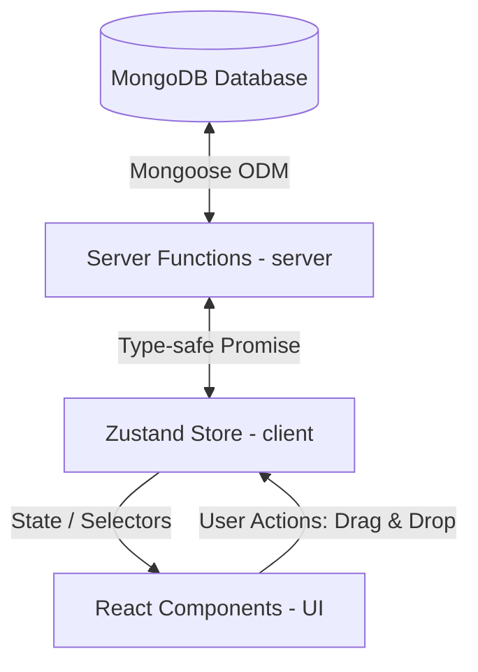

# 01. Přehled Architektury (Architecture Overview)

Tento dokument definuje celkovou architekturu, technologický stack a tok dat pro jednoduchou aplikaci na sestavování tréninkových plánů (**Training Planner**) postavenou na moderním fullstack frameworku **TanStack Start**.

Aplikace je navržena jako vysoce optimalizovaná, typově bezpečná SPA (Single Page Application) s integrovaným serverovým během a flexibilní databází MongoDB. Umožňuje snadno definovat různé druhy cviků a sestavovat je do časových bloků.

---

## 1. Technologický Stack (Tech Stack)

Volba technologií je podřízena maximální typové bezpečnosti (type-safety), plynulému UX a čistotě kódu:

### **Frontend & Backend (Fullstack Framework)**
*   **TanStack Start**: Moderní fullstack React framework postavený na **Vite**, **Vinxi** a **TanStack Routeru**. Umožňuje psát klientský i serverový kód v jednom projektu s automatickým přenosem typů z databáze až do UI.
*   **TanStack Router**: Souborově orientovaný (file-based) router s 100% typovou bezpečností.
*   **Server Functions (`createServerFn`)**: Mechanismus TanStack Start, který umožňuje volat serverový kód (např. databázové dotazy Mongoose) přímo z klientských komponent jako běžné asynchronní funkce s plným typováním.
*   **CSS Modules (Vanilla CSS)**: Čisté CSS zapouzdřené na úrovni komponent pro plnou kontrolu nad animacemi, přechody a prémiovým vzhledem bez nutnosti Tailwindu.
*   **Zustand**: Lehká správa lokálního interaktivního stavu na frontendu (aktivně upravovaný plán, stav Drag & Drop).
*   **@dnd-kit/core & @dnd-kit/sortable**: Přístupná a vysoce výkonná knihovna pro Drag and Drop v Reactu.
*   **PWA (Serwist)**: Integrace Progressive Web App pro plnou instalovatelnost aplikace na plochu telefonu (iOS / Android) a caching statických prostředků pro offline spuštění.

### **Databáze & Validace**
*   **MongoDB**: Dokumentová databáze umožňující flexibilní ukládání různorodých metrik tréninků (fitness vs. box vs. kardio) na straně serveru.
*   **IndexedDB (Dexie.js)**: Klientská relační databáze přímo v prohlížeči. Slouží k ukládání stažených tréninkových sad, lokálních změn a offline fronty (outbox queue).
*   **Mongoose**: ODM pro bezpečné a strukturované dotazování do MongoDB na straně serveru.
*   **Zod**: Deklarativní validace dat pro serverové funkce i formuláře.

---

## 2. Navržená Struktura Projektu (Directory Structure)

Vzhledem k tomu, že **TanStack Start** využívá standardní strukturu postavenou na adresáři `app/` a souborech `client.tsx` / `ssr.tsx`, navrhujeme následující strukturu:

```text
training-planner/
├── context/                     # Specifikace architektury (tyto soubory)
├── public/                      # Statické soubory
├── app/                         # Hlavní adresář aplikace (TanStack Start)
│   ├── routes/                  # Souborový routing TanStack Routeru
│   │   ├── __root.tsx           # Hlavní obalovací layout (hlavička, patička, DevTools)
│   │   ├── index.tsx            # Hlavní stránka plánovače (Dashboard / Planner)
│   │   └── api/                 # Volitelné standardní API endpointy
│   ├── components/              # Znovupoužitelné UI komponenty
│   │   ├── ui/                  # Tlačítka, vstupy, modály s CSS modules
│   │   ├── exercise-library/    # Katalog cviků
│   │   └── planner/             # Časová osa a Drag & Drop zóny
│   ├── db/                      # Připojení k databázi a Mongoose modely
│   │   ├── connect.ts           # Inicializace připojení k MongoDB
│   │   ├── Exercise.ts          # Mongoose model pro Cvik
│   │   └── TrainingPlan.ts      # Mongoose model pro Tréninkový Plán
│   ├── store/                   # Zustand store pro lokální stav plánovače
│   │   └── usePlannerStore.ts   # Lokální změny a dnd-state
│   ├── styles/                  # Globální styly a CSS proměnné
│   │   ├── variables.css        # Barevná paleta, rozměry, blur efekty
│   │   └── globals.css          # Reset stylů
│   ├── client.tsx               # Vstupní bod pro klientský render
│   ├── router.tsx               # Konfigurace TanStack Routeru
│   └── ssr.tsx                  # Vstupní bod pro Server-Side Rendering
├── package.json
├── tsconfig.json                # Důležité pro plnou typovou bezpečnost TanStacku
└── vite.config.ts               # Konfigurace bundleru Vite / Vinxi
```

---

## 3. Tok Dat v Aplikaci (Data Flow)

Díky **Server Functions** v TanStack Start nepotřebujeme definovat klasické REST API endpointy (i když je to možné). Data tečou přímo přes bezpečné serverové funkce:



### **Popis toku:**
1.  **Načtení dat (Server-side)**: Při vstupu na stránku vyvolá TanStack Router loader, který zavolá serverovou funkci `getExercisesFn` a `getPlansFn`. Tyto funkce na serveru otevřou spojení přes Mongoose do MongoDB a vrátí plně typovaná data klientovi.
2.  **Správa stavu (Client-side)**: Zustand Store na frontendu převezme načtená data a spravuje aktuální interaktivní relaci (např. rozpracované změny v tréninkovém plánu před uložením).
3.  **Drag & Drop interakce**: Uživatel přetáhne cvik. Zustand okamžitě zaktualizuje lokální stav (optimistický render), čímž zaručí nulové zpoždění UI.
4.  **Bezpečné uložení**: Po skončení úprav (nebo debounced intervalu) Zustand zavolá serverovou funkci `savePlanFn(updatedPlan)`. Tato funkce na serveru zvaliduje data pomocí Zod a uloží je přímo do MongoDB.

---

## 4. Klíčová Rozhodnutí (Design Decisions)

*   **Proč TanStack Start namísto Next.js?**
    *   **100% Typová bezpečnost**: Nemusíme složitě synchronizovat typy mezi API endpointem a frontendem. Pokud se změní struktura modelu v Mongoose, TypeScript okamžitě nahlásí chyby všude na frontendu, kde se tato data používají.
    *   **Server Functions**: Funkce `createServerFn` odstraňují nutnost psát klasické kontrolery a routy. Volání databáze vypadá na frontendu jako běžné asynchronní volání funkce, ale bezpečně se vykoná na serveru.
*   **Proč MongoDB a Mongoose?**
    Různé sporty vyžadují různé tréninkové metriky. Dokumentový model MongoDB nám umožňuje uložit flexibilní objekt `metrics`, který u boxu obsahuje kola a u fitness váhu a opakování, bez nutnosti vytvářet komplikované tabulky v SQL.
*   **Proč CSS Modules?**
    Umožňují nám psát prémiový kód s glassmorfismem a plynulými přechody drop zón, přičemž styly zůstávají zapouzdřené a čisté bez záplavy utilitárních tříd.
*   **Absence Autentizace (Single-User MVP)**:
    Pro potřeby vývoje, testování a rychlého nasazení MVP zcela **vypouštíme přihlašování a registraci uživatelů (No Auth)**. Aplikace funguje jako lokální/globální plánovač pro jednoho uživatele. To radikálně zjednodušuje databázová schémata i API vrstvu. V případě budoucího rozšíření na multi-user platformu stačí pouze přidat vazební sloupec `userId` do modelů `Exercise` a `TrainingPlan`.

---

## 5. Bezpečnost (Security)

V rámci zajištění stability a bezpečnosti dodavatelského řetězce (supply chain security) je definováno následující pravidlo pro správu závislostí:

*   **Pravidlo 3 dnů pro NPM balíčky**: Do projektu smí být instalovány pouze ty verze NPM balíčků, které jsou publikovány v registru **minimálně 3 dny**. Toto opatření slouží jako prevence proti „malicious“ verzím balíčků, které jsou často staženy z registru krátce po odhalení. Před instalací nebo aktualizací jakékoli knihovny je nutné ověřit datum vydání dané verze.
