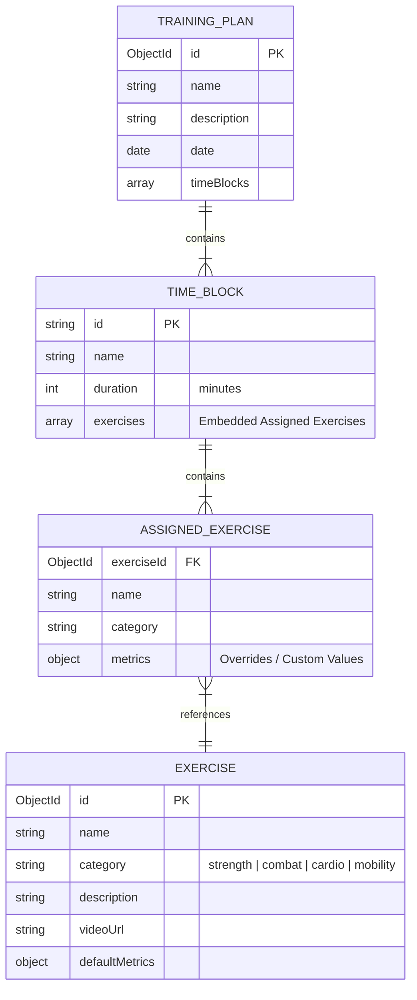

# 02. Databázová Vrstva (Database Layer)

Tento dokument detailně popisuje návrh databáze v **MongoDB** a definici modelů pomocí **Mongoose ORM**. 

Vzhledem k povaze fitness a bojových sportů je kladen důraz na **flexibilitu schémat**, která umožní ukládat různé metriky pro různé typy tréninku (např. síla vs. kardio vs. box).

---

## 1. Koncepční Model Dat (Data Model)

Navrhujeme dvě hlavní kolekce v databázi:
1.  **`exercises`** (Knihovna cviků): Globální katalog cviků, ze kterého si uživatel vybírá.
2.  **`training_plans`** (Tréninkové plány): Obsahuje časové bloky a v nich zařazené cviky s konkrétními nastavenými parametry.

Časové bloky jsou navrženy jako **vnořené dokumenty (Embedded Documents)** uvnitř Tréninkového plánu. Toto řešení je pro MongoDB ideální, protože plán a jeho bloky se vždy načítají a ukládají společně. Zamezíme tak nutnosti provádět drahé operace typu `JOIN` ($lookup).



---

## 2. Mongoose Schémata (Mongoose Schemas)

Níže jsou uvedeny implementační návrhy Mongoose schémat.

### A. Cvik (`app/db/Exercise.js`)

Definuje základní strukturu cviku v katalogu.

```javascript
import mongoose from 'mongoose';

const ExerciseSchema = new mongoose.Schema({
  name: {
    type: String,
    required: [true, 'Název cviku je povinný.'],
    trim: true,
    index: true // Rychlé vyhledávání podle názvu
  },
  category: {
    type: String,
    required: [true, 'Kategorie je povinná.'],
    enum: ['strength', 'combat', 'cardio', 'mobility', 'stretch'],
    default: 'strength'
  },
  description: {
    type: String,
    trim: true
  },
  videoUrl: {
    type: String,
    trim: true
  },
  // Výchozí hodnoty pro usnadnění práce při vložení cviku do plánu
  defaultMetrics: {
    // Pro silový trénink
    sets: { type: Number, default: 3 },
    reps: { type: Number, default: 10 },
    weight: { type: Number, default: 0 }, // v kg
    
    // Pro časový trénink / kardio / box
    duration: { type: Number, default: 0 }, // v sekundách
    rounds: { type: Number, default: 1 },
    roundDuration: { type: Number, default: 180 }, // v sekundách (např. 3 minuty na kolo v boxu)
    restDuration: { type: Number, default: 60 } // v sekundách
  }
}, {
  timestamps: true // Vytvoří createdAt a updatedAt
});

// Kontrola, zda model již neexistuje (důležité pro hot reload v TanStack Start / Vite)
export default mongoose.models.Exercise || mongoose.model('Exercise', ExerciseSchema);
```

### B. Tréninkový Plán (`app/db/TrainingPlan.js`)

Obsahuje kompletní strukturu plánu včetně vnořených časových bloků a přiřazených cviků.

```javascript
import mongoose from 'mongoose';

// Schéma pro přiřazený cvik uvnitř časového bloku
const AssignedExerciseSchema = new mongoose.Schema({
  exerciseId: {
    type: mongoose.Schema.Types.ObjectId,
    ref: 'Exercise',
    required: true
  },
  name: {
    type: String,
    required: true
  },
  category: {
    type: String,
    required: true
  },
  // Konkrétní upravené hodnoty pro tento tréninkový den
  metrics: {
    sets: { type: Number },
    reps: { type: Number },
    weight: { type: Number },
    
    duration: { type: Number },
    rounds: { type: Number },
    roundDuration: { type: Number },
    restDuration: { type: Number }
  }
});

// Schéma pro časový blok (Time Block)
const TimeBlockSchema = new mongoose.Schema({
  id: {
    type: String,
    required: true // UUID generované na frontendu/backendu pro správné párování v dnd-kit
  },
  name: {
    type: String,
    required: true,
    default: 'Nový Blok tréninku',
    trim: true
  },
  duration: {
    type: Number,
    required: true,
    default: 15 // Délka bloku v minutách (např. 15 minut na rozcvičku)
  },
  exercises: [AssignedExerciseSchema] // Vnořené pole přiřazených cviků
});

// Hlavní schéma Tréninkového plánu
const TrainingPlanSchema = new mongoose.Schema({
  name: {
    type: String,
    required: [true, 'Název plánu je povinný.'],
    trim: true
  },
  description: {
    type: String,
    trim: true
  },
  date: {
    type: Date,
    required: [true, 'Datum tréninku je povinné.'],
    default: Date.now,
    index: true // Rychlé načítání podle kalendářních dnů
  },
  timeBlocks: [TimeBlockSchema] // Vnořené pole časových bloků
}, {
  timestamps: true
});

export default mongoose.models.TrainingPlan || mongoose.model('TrainingPlan', TrainingPlanSchema);
```

---

## 3. Flexibilita Metrik (Příklad Použití)

Při ukládání metrik využíváme toho, že MongoDB nevyžaduje vyplnění všech polí. V závislosti na kategorii cviku vyplníme pouze to, co je relevantní:

### **Příklad 1: Benchpress (Silový trénink - Kategorie: `strength`)**
```json
{
  "exerciseId": "65fc2b78a1bc2d9812345678",
  "name": "Benchpress",
  "category": "strength",
  "metrics": {
    "sets": 4,
    "reps": 8,
    "weight": 85
  }
}
```

### **Příklad 2: Lapování s trenérem (Bojový trénink - Kategorie: `combat`)**
```json
{
  "exerciseId": "65fc2b78a1bc2d9812345679",
  "name": "Práce na lapách",
  "category": "combat",
  "metrics": {
    "rounds": 5,
    "roundDuration": 180,
    "restDuration": 60
  }
}
```

### **Příklad 3: Běh na páse (Kardio trénink - Kategorie: `cardio`)**
```json
{
  "exerciseId": "65fc2b78a1bc2d9812345680",
  "name": "Běh na páse (Intervaly)",
  "category": "cardio",
  "metrics": {
    "duration": 1200 // 20 minut
  }
}
```

Tento přístup zajišťuje, že aplikace je vysoce **univerzální** a dokáže obsloužit jak kulturistu, tak boxera nebo běžce.
