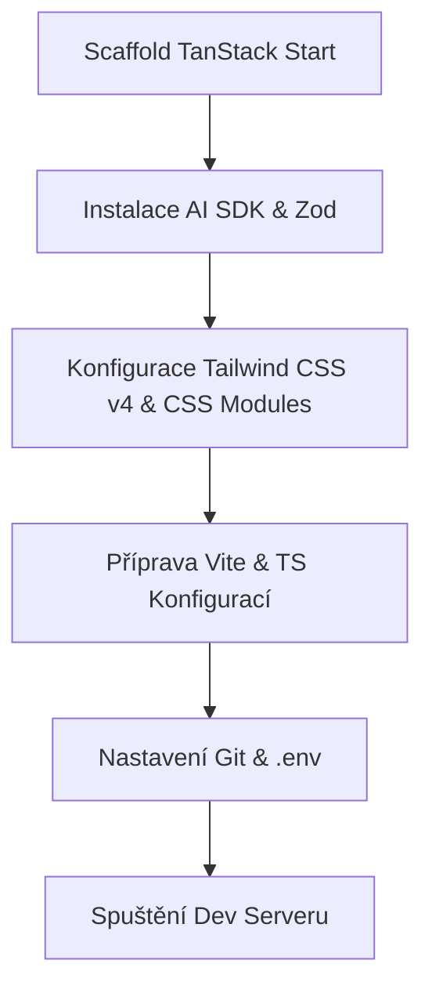

# 01. Inicializace Projektu a Kostra Aplikace (Skeleton Initialization)

Tento dokument slouží jako detailní technická specifikace (Feature Spec) pro první fázi vývoje: **Inicializaci projektu a přípravu kostry aplikace**. Definuje přesný postup instalace, konfigurace bundlerů, zapojení Tailwind CSS v4, integrace Vercel AI SDK a nastavení git repozitáře.

---

## 🗺️ Přehled Fází Inicializace



---

## 1. Scaffold TanStack Start (`npx`)

Aplikace bude postavena na moderním fullstack frameworku **TanStack Start**. K instalaci čisté kostry použijeme oficiální šablonu.

### Instalační příkazy:
```bash
# Vytvoření projektu v aktuálním adresáři
npx -y create-tanstack-app@latest ./ --template start-basic
```

### Očekávaná výchozí struktura složek:
```text
training-planner/
├── app/
│   ├── routes/
│   │   └── __root.tsx
│   ├── client.tsx
│   ├── router.tsx
│   └── ssr.tsx
├── public/
├── package.json
├── tsconfig.json
└── vite.config.ts
```

---

## 2. Instalace AI Balíčků & Závislostí (AI SDK & Core Packages)

Pro budoucí chytré generování a úpravu tréninkových plánů pomocí umělé inteligence integrujeme **Vercel AI SDK**, které je standardem pro React/TypeScript aplikace.

### Instalované balíčky:
1. **`ai`** - Jádro Vercel AI SDK pro streamování a správu UI stavů.
2. **`@ai-sdk/google`** - Poskytovatel (Provider) pro Google Gemini modely (např. `gemini-2.5-pro` nebo `gemini-2.5-flash`), které jsou nativně podporovány prostředím.
3. **`zod`** - Deklarativní validace dat pro bezpečný přenos a strukturované AI výstupy.

### Příkaz pro instalaci:
```bash
npm install ai @ai-sdk/google zod dexie
```

---

## 3. Příprava Konfigurací (Vite & TS Config)

Vzhledem k tomu, že TanStack Start využívá pod kapotou **Vinxi** a **Vite**, musíme správně nastavit `vite.config.ts` a `tsconfig.json` pro plnou podporu TypeScriptu a aliasů.

### A. Konfigurace Vite (`vite.config.ts`)
Konfigurace bude rozšířena o podporu Tailwind CSS v4 a cesty k aliasům.

```typescript
import { defineConfig } from 'vite';
import { tanstackStartVite } from '@tanstack/start/vite';
import tailwindcss from '@tailwindcss/vite';
import path from 'path';

export default defineConfig({
  plugins: [
    tailwindcss(), // Nový Vite plugin pro Tailwind CSS v4
    tanstackStartVite()
  ],
  resolve: {
    alias: {
      '~': path.resolve(__dirname, './app'),
    },
  },
});
```

### B. Konfigurace TypeScriptu (`tsconfig.json`)
Musí plně podporovat typy TanStack Routeru a mapování cest přes `~/*`.

```json
{
  "compilerOptions": {
    "target": "ES2022",
    "useDefineForClassFields": true,
    "lib": ["DOM", "DOM.Iterable", "ES2022"],
    "module": "ESNext",
    "skipLibCheck": true,

    /* Bundler mode */
    "moduleResolution": "bundler",
    "allowImportingTsExtensions": true,
    "resolveJsonModule": true,
    "isolatedModules": true,
    "noEmit": true,
    "jsx": "react-jsx",

    /* Linting */
    "strict": true,
    "noUnusedLocals": true,
    "noUnusedParameters": true,
    "noFallthroughCasesInSwitch": true,

    /* Path mapping */
    "baseUrl": ".",
    "paths": {
      "~/*": ["./app/*"]
    }
  },
  "include": ["app", "vite.config.ts"]
}
```

---

## 4. Nastavení Tailwind CSS v4

Projekt bude využívat nejnovější verzi **Tailwind CSS v4**, která přináší extrémní rychlost díky nativnímu Vite kompilátoru a plně CSS-first konfiguraci (bez nutnosti `tailwind.config.js`).

### Postup nastavení:

1. **Instalace Tailwindu**:
   ```bash
   npm install tailwindcss @tailwindcss/vite
   ```

2. **Vytvoření globálního CSS souboru** (`app/styles/globals.css`):
   Zde naimportujeme Tailwind a definujeme základní barevné proměnné z našeho design systému (včetně glassmorfismu).

   ```css
   @import "tailwindcss";

   @theme {
     --color-bg-primary: #0a0c10;
     --color-bg-secondary: #12161f;
     --color-bg-tertiary: #1b202c;
     
     --color-accent: #00f2fe;
     --color-accent-blue: #4facfe;
     
     --color-strength: #ff5e62;
     --color-combat: #ff9f43;
     --color-cardio: #1dd1a1;
     
     --color-text-main: #f3f6f9;
     --color-text-muted: #8292a6;
     
     --animate-pulse-glow: pulseGlow 1.5s infinite alternate;
   }

   @keyframes pulseGlow {
     0% {
       box-shadow: 0 0 10px rgba(0, 242, 254, 0.05);
     }
     100% {
       box-shadow: 0 0 20px rgba(0, 242, 254, 0.15);
     }
   }

   /* Základní reset a globální styly */
   html, body {
     background-color: var(--color-bg-primary);
     color: var(--color-text-main);
     font-family: 'Inter', system-ui, -apple-system, sans-serif;
     min-height: 100vh;
     margin: 0;
     overflow-x: hidden;
   }
   ```

3. **Import stylů v root layoutu** (`app/routes/__root.tsx`):
   ```tsx
   import { createRootRoute } from '@tanstack/react-router';
   import { Outlet, ScrollRestoration } from '@tanstack/react-router';
   import { Meta, Scripts } from '@tanstack/start';
   import '../styles/globals.css'; // Globální import stylů

   export const Route = createRootRoute({
     component: RootComponent,
   });

   function RootComponent() {
     return (
       <html lang="cs">
         <head>
           <Meta />
         </head>
         <body>
           <Outlet />
           <ScrollRestoration />
           <Scripts />
         </body>
       </html>
     );
   }
   ```

---

## 5. Nastavení Vývojového Serveru (Dev Server Scripts)

Upravíme skripty v `package.json` pro plynulý lokální běh, sestavení produkčního buildu a spuštění testů.

### Skripty v `package.json`:
```json
"scripts": {
  "dev": "vinxi dev",
  "build": "vinxi build",
  "start": "vinxi start"
}
```

Uživatel může spustit lokální server příkazem `npm run dev`. Vývojový server poběží na adrese `http://localhost:3000`.

---

## 6. Konfigurace Git a Gitignore

Abychom zabránili úniku citlivých údajů (API klíčů, připojení k databázi) a chránili repozitář před zbytečnými buildy, striktně nakonfigurujeme soubor `.gitignore`.

### Obsah souboru `.gitignore`:
```text
# Dependency directories
node_modules/
jspm_packages/

# Build outputs
.output/
.vinxi/
dist/
build/
.cache/

# Environment variables (CRITICAL)
.env
.env.local
.env.development.local
.env.test.local
.env.production.local

# OS files
.DS_Store
Thumbs.db

# IDE and Editor configs
.idea/
.vscode/
*.suo
*.ntvs*
*.njsproj
*.sln
*.swp

# Local database locks / logs
*.log
.pnpm-debug.log*
yarn-debug.log*
yarn-error.log*
```

---

## 7. Konfigurace Environment Variables (.env)

Pro zajištění bezpečnosti oddělujeme citlivé serverové klíče od klientských proměnných. 

> [!IMPORTANT]
> **Bezpečnostní pravidlo**: Citlivé údaje (jako `GEMINI_API_KEY` nebo `MONGODB_URI`) **nesmí** mít prefix `VITE_` a **nikdy nesmí** být vystaveny klientskému kódu. Přístup k nim je povolen výhradně ze serverového prostředí (Server Functions).

### A. Přehled Proměnných a Výchozí Hodnoty

| Název proměnné | Cílové prostředí | Kontext | Popis |
| :--- | :--- | :--- | :--- |
| `NODE_ENV` | Obě | Server/Klient | Určuje režim běhu (`development` / `production`). |
| `MONGODB_URI` | Obě (Různé DB) | Pouze Server | Připojovací řetězec k MongoDB. |
| `GEMINI_API_KEY` | Obě (Různé klíče) | Pouze Server | API klíč pro Google Gemini (AI SDK). |
| `VITE_APP_URL` | Obě (Různé URL) | Server/Klient | Origin url aplikace (např. `http://localhost:3000` / `https://planner.app`). |

### B. Šablona Společná (`.env.example`)
Tento soubor se commituje do repozitáře jako vzor.

```text
# Jádro a prostředí
NODE_ENV=development
VITE_APP_URL=http://localhost:3000

# Databáze (Pouze Server)
MONGODB_URI=mongodb://localhost:27017/training-planner

# AI SDK (Pouze Server)
GEMINI_API_KEY=your_gemini_api_key_here
```

### C. Vývojové Prostředí (`.env.development`)
Určeno pro lokální Docker MongoDB nebo lokální in-memory testování.

```text
NODE_ENV=development
VITE_APP_URL=http://localhost:3000
MONGODB_URI=mongodb://localhost:27017/training-planner-dev
GEMINI_API_KEY=dev_key_abc123xyz
```

### D. Produkční Prostředí (`.env.production`)
Určeno pro produkční servery (MongoDB Atlas, Cloud Console).

```text
NODE_ENV=production
VITE_APP_URL=https://training-planner.tomas.cz
MONGODB_URI=mongodb+srv://prod-cluster.mongodb.net/training-planner-prod
GEMINI_API_KEY=prod_key_secure987qwe
```

---

## 8. Nastavení Testovacího Prostředí (Test Suite)

Pro zajištění vysoké kvality kódu a splnění pravidel při velkých refaktorech zprovozníme hybridní testovací prostředí:

1. **Vitest** (Unit a Integrační testy): Pro okamžitou verifikaci stavu Zustand storu, validací Zod, lokálního Dexie.js úložiště a pomocných funkcí.
2. **Playwright** (E2E a PWA testy): Pro automatické testování drag-and-drop, offline chování a synchronizace na reálných emulovaných zařízeních (včetně mobilních).

### A. Instalace Testovacích Závislostí
```bash
# Instalace Vitestu a Playwrightu
npm install -D vitest @vitejs/plugin-react @testing-library/react @testing-library/jest-dom jsdom @playwright/test
```

### B. Konfigurace Vitest (`vitest.config.ts`)
Vytvoříme dedikovaný konfigurační soubor běžící na stejném Vite enginu.

```typescript
import { defineConfig } from 'vitest/config';
import react from '@vitejs/plugin-react';
import path from 'path';

export default defineConfig({
  plugins: [react()],
  test: {
    globals: true,
    environment: 'jsdom',
    setupFiles: './tests/setup.ts',
    include: ['app/**/*.test.{ts,tsx}', 'tests/**/*.test.{ts,tsx}'],
    alias: {
      '~': path.resolve(__dirname, './app'),
    },
  },
});
```

### C. Globální Setup Testů (`tests/setup.ts`)
Mockování IndexedDB (pro Dexie) a globálních API prohlížeče.

```typescript
import '@testing-library/jest-dom';
import 'fake-indexeddb/auto'; // Automatické mockování IndexedDB v testech

// Mockování navigator.onLine pro testování offline scénářů
Object.defineProperty(navigator, 'onLine', {
  writable: true,
  value: true,
});
```

### D. Konfigurace Playwright E2E (`playwright.config.ts`)
Nastavení pro end-to-end simulaci offline stavů a PWA chování.

```typescript
import { defineConfig, devices } from '@playwright/test';

export default defineConfig({
  testDir: './e2e',
  fullyParallel: true,
  forbidOnly: !!process.env.CI,
  retries: process.env.CI ? 2 : 0,
  workers: process.env.CI ? 1 : undefined,
  reporter: 'html',
  use: {
    baseURL: 'http://localhost:3000',
    trace: 'on-first-retry',
  },
  projects: [
    {
      name: 'chromium',
      use: { ...devices['Desktop Chrome'] },
    },
    {
      name: 'mobile-chrome',
      use: { ...devices['Pixel 5'] }, // Testování mobilního TouchSensoru
    },
  ],
  webServer: {
    command: 'npm run build && npm run start',
    url: 'http://localhost:3000',
    reuseExistingServer: !process.env.CI,
  },
});
```

### E. Aktualizace Skriptů v `package.json`
Příprava rychlého spouštění testů v CLI.

```json
"scripts": {
  "dev": "vinxi dev",
  "build": "vinxi build",
  "start": "vinxi start",
  "test:unit": "vitest run",
  "test:unit:watch": "vitest",
  "test:e2e": "playwright test",
  "test:e2e:ui": "playwright test --ui"
}
```

---

## 🎯 Akceptační Kritéria (Acceptance Criteria)

Tato fáze je považována za úspěšně dokončenou, pokud:
1. Příkaz `npm run dev` bezchybně nastartuje vývojový server Vinxi.
2. Globální styly Tailwind CSS v4 jsou správně aplikovány na `__root.tsx`.
3. Všechny TypeScript typy a cesty (`~/*`) se v editoru správně překládají a nevykazují chyby.
4. Soubory `.env.development`, `.env.production` a `.env.example` jsou vytvořeny a `.env` je bezpečně zapsán v `.gitignore`.
5. Balíčky `ai` a `@ai-sdk/google` jsou nainstalovány a připraveny v `package.json`.
6. Příkaz `npm run test:unit` úspěšně vyhledá a spustí unit testy přes Vitest.
7. Playwright je připraven k testování jak na desktopu, tak na emulovaném mobilním zařízení (`Pixel 5`).

